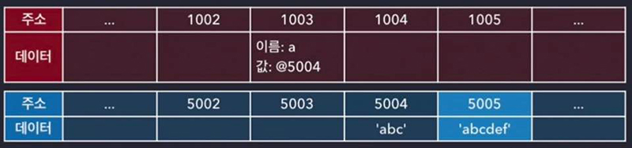
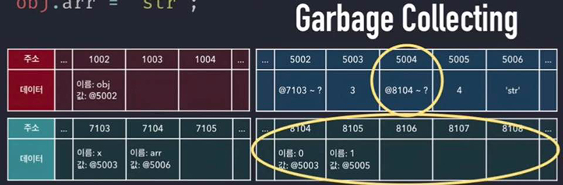
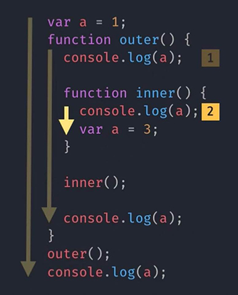
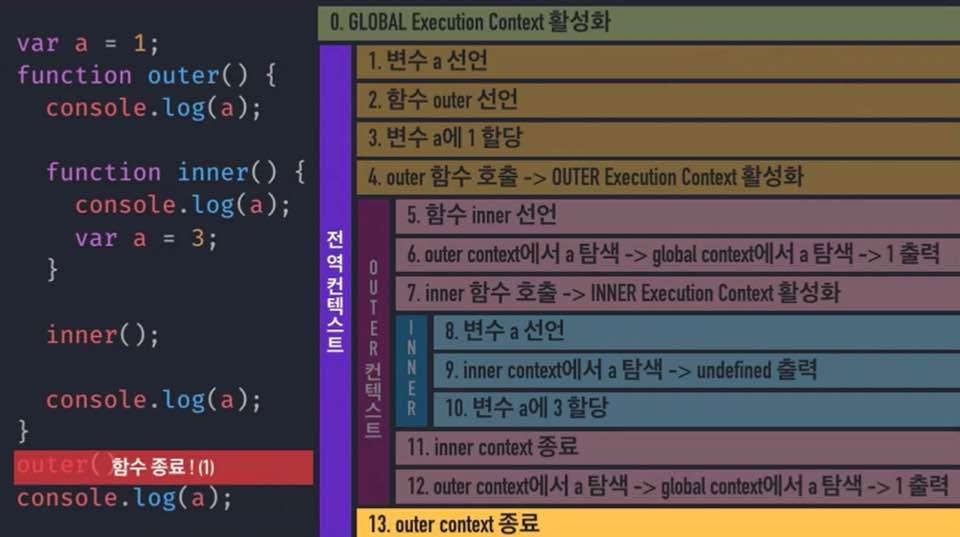
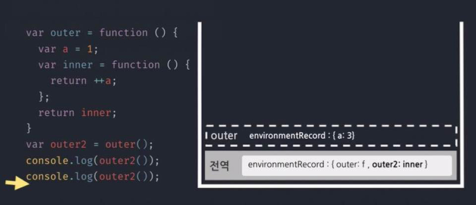
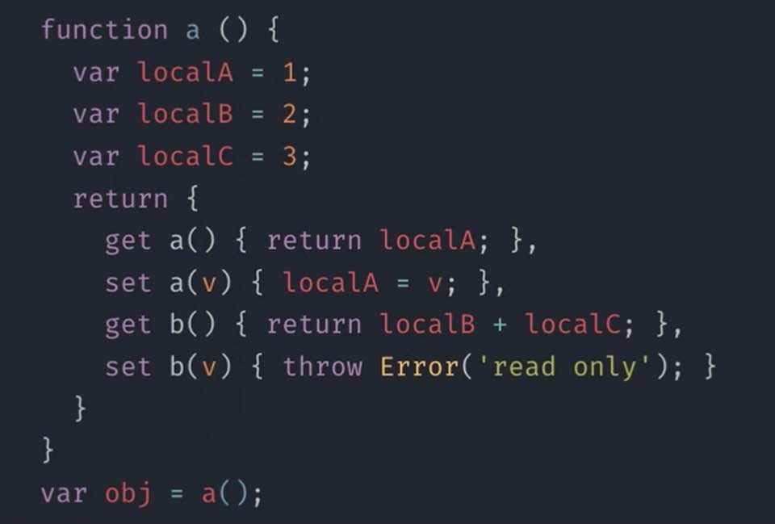

# Core Javascript

```
1. Data Types (데이터 타입)
2. Execution Context (실행 콘텍스트)
3. This
4. callback 
5. Closure
```

## Data Types
### Primitive Type (기본형)
1. Number
2. String
3. Boolean
4. null
5. undefined

### Reference Type (참조형)
1. Object
    * Array
    * Function
    * RegExp
    
    * 한번 더 거쳐가는 형태
    * 참조가 0인 형대가 나타남
    * 같은 값은 오직 하나의 데이터만 차지함

## Execution Context (실행 콘텍스트)
1. 동일한 조건, 환경을 지니는 코드뭉치 = 함수, 전역공간 / 흐름상의 조건,환경정보
2. 환경정보를 담은 객체
3. call stack : 현재 어떤 함수가 동작하는지, 다음에 어떤 함수가 호출되어야 하는지에 대한 자료구조

4. inner
    * 순서 
        1. 변수 선언 `var a=1` 의 `var a`
        2. 함수선언 `outer()`
        3. 변수에 a에 1 할당 `var a=1`
        4. 함수 활성화 
    * VariableEnvironment 
        * 순간적인 값만 유지되는 형태
        * environmentRecord
        * outerEnvironmentReference
    * **LexicalEnvironment**
        * 이후의 값 변경을 계속 반영하는 형태
        * `environmentRecord` 현재 문맥의 식별자 정보 === Hoisting(끌어올리다)
            * 식별자를 맨 위로 끌어올림
        * `outerEnvironmentReference` 현재 문맥에 관련 있는 외부 식별자 정보
            * Scope Chain
                * scope: 변수의 유효 범위
                * chain: 실행 콘텍스트에 의해 결정
            * `inner`에서 선언한 변수는 `outer`로 갈 수 없음
            * `inner`의 변수는 오직 `inner` 안에서만 존재
            * `var a=2` 를 찾아야 할 때 `inner`에 없으면 `outer`에서 찾게 됨
    * ThisBinding


## This
### this의 주체
* this 는 함수가 호출될 때 활성화 됨


#### 메소드 호출시


* 내부 함수에서의 오류
아래와 같은 결과 도출 때문에 변수에 넣어서 사용해야 한다.

함수는 window/global을 호출하기 때문에 c() 호출시 b에 선언된 변수 a가 없으므로 global을 가리킴

#### callback 호출 시
1. 기본적으로는 함수의 this와 같음
2. 제어권을 가진 함수가 callback의 this를 명시한 경우 그에 따름
3. 개발자가 this를 바인딩한 채로 callback을 넘기면 그에 따름

## callback
* 호출해서 돌려줄 함수
* 결과를 처리해줘 -> 알아서 해서 줄게 (제어권을 맡김)
* 다른 함수(A)의 인자로 콜백함수(B)를 전달하면, A가 B의 제어권을 갖게 됨
* A에 미리 정해 놓은 방식에 따라 B를 호출함
    * 시점
    * 인자
    * this
* 주의: **콜백은 함수다**
```
var arr = [1, 2, 3, 4, 5];
var obj = {
    vals: [1, 2, 3],
    logValues: function(v, i){
        if(this.vals) {
            console.log(this.vals, v, i);
        } else {
            console.log(this, v, i)
        }
    }
}

obj.logValues(1, 2); // 1, 2, 3, 1, 2
arr.forEach(obj.logValues); // 함수만 넘겨줌. this는 global window
```

1. 실행 시점의 제어권
    * ex_ `setInterval( callback, milliseconds )`
    * `setInterval(function(){ console.log('1초마다 실행') }, 1000);`
    * `setInterval()` : 주기함수 호출
    * `function(){console.log('1초마다 실행')}`: 인자1 - 콜백함수
    * `1000` : 인자2 - 주기
2. 인자의 제어권
    * ex_ `forEach(function(v, i){})` // 첫번째에는 값을, 두번째에는 index를 넣어줌
    * `function(v, i){...}` : 인자1 - 콜백함수
    * `[10, 20, 30, 40, 50]` : 인자2: this로 인식할 대상 (생략가능)
```
var arr = [1, 2, 3, 4, 5];
var entries = [];
arr.forEach(function(v, i){
    entries.push([i, v, this[i]]);
}, [10, 20, 30, 40, 50]);
console.log(entries)
//[ [0, 1, 10], [1, 2, 20], [2, 3, 30], [3, 4, 40], [4, 5, 50] ]
```
3. this
```
document.body.innerHTML = '<div id="a">abc</div>';
function cbFunc(x){
    console.log(this, x)
}

document.getElementId('a').addEventListener('click', cbFunc);
// <div id="a">abc</div>, MouseEvent{isTrused: true, screenX: 11}
```

## Closure

* 함수 종료 후에도 사라지지 않는 변수를 만들 수 있음
* 컨텍스트 A에서 선언한 변수a를 참조하는 내부함수 B를 A의 외부로 전달할 경우 A가 종료된 이후에도 a가 사라지지 않는 현상
* [my note] 클로져가 만들어지는 조건은 함수 내부에 있는 함수/ 밖에 있는 함수의 변수가 계속 결과 값에 영향을 주는 형상. 
* 계속 유지해야할 변수들은 몇 안됨. 초기에 계속 유지해야할 변수들을 클로져로 세팅

* 클로저를 유용하게 사용하고 있는 예 
    * 지역변수를 직접 변경하지 않고 보호하며 접근
    * 함수에 의지를 부여할 수 있음

