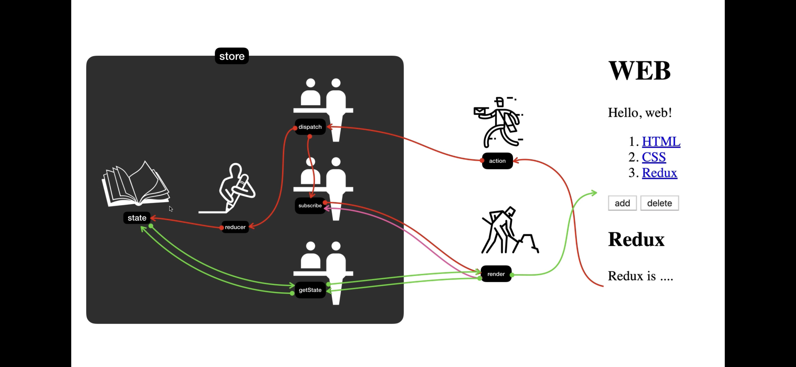
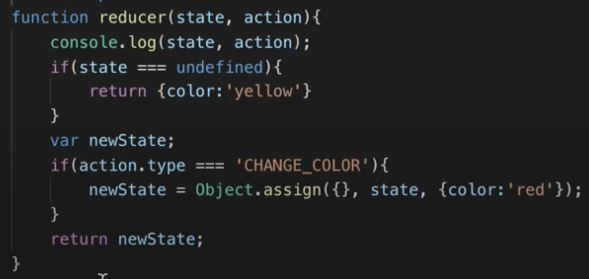
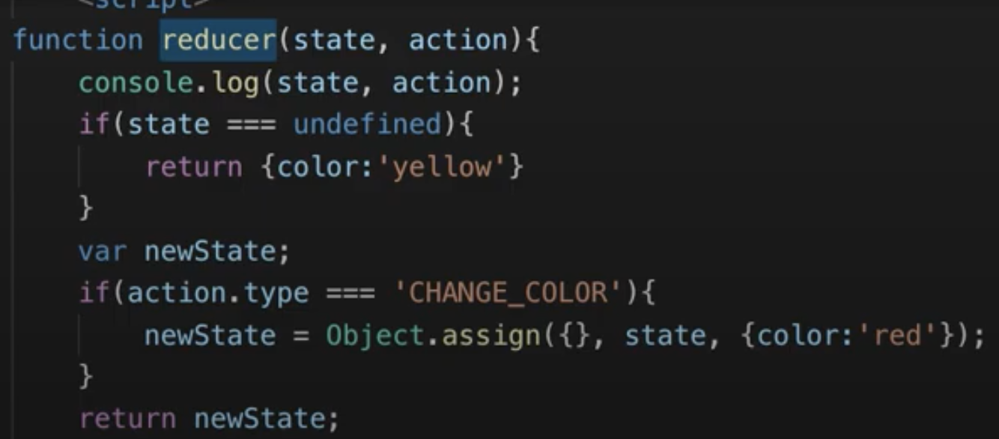
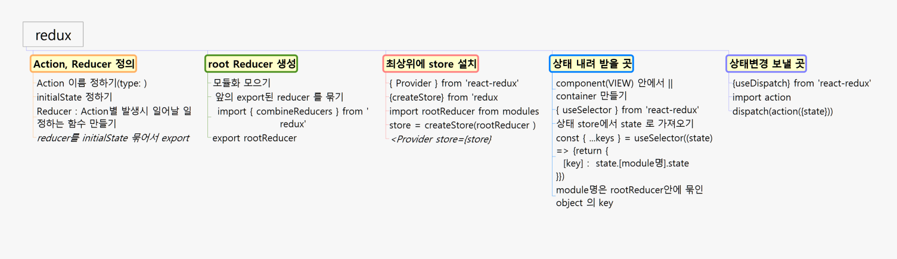

# 리덕스 공부하기

npm install --save redux

생활코딩 리덕스 공부자료 [생활코딩 유튜스](https://www.youtube.com/watch?v=Jr9i3Lgb5Qc&list=PLuHgQVnccGMB-iGMgONoRPArZfjRuRNVc)

## 5-1 강의
1. store를 생성해준다. / store를 생성하면 자동으로 그 안에 state가 생성된다. 
2. reducer를 만들어준다 (내가 만들어주는 함수)
    * 최초 한번은 무조건 실행된다. 
    * 리듀서의 역할 : state 값을 만들어준다. / action값고 state값을 참조하여 작동 / ex. 은행창구 직원 다음 장부에 기록하는 사람 
    * getState의 역할 : store에 있는 state 값을 가지고 온다.
    
`
function reducer(state, action){
    //(이전 스테이트, 액션)
    //스토어의 초기 상태정의, 최초 한번 (state === undefined)
    if(state === undefined){
        return {color: '원하는 초기값'} 
    }
}
Redux.createStore(reducer);

잘되었는지 확인하기 위해서
var store = Redux.createStore(reducer);
console.log(store.getState());
`
> index.js ( store ), reducer/index.js , reducer/postReducer.js

## 5-2 강의 
3. store의 state 값을 바꾸고 싶다면 action을 만들어서 dispatch에게 제출하면 dispatch가 reducer를 호출하게되고 reducer가 state에게 최종적으로 처리할 값을 알려주면 상태값이 바꾸게 된다.

* 스토어의 값을 바꾸지 말고 스토어의 스테이트 값을 복사하고 복제본을 바꿔서 리턴해야 예측가능하게 app을 제작할 수 있다.
`
object.assign({}, {})
// {이 곳에 복사할 것이다}, {name: 'egoing'}을
// 첫번째 객체는 꼭 비어있어야 한다.
`

## 5-3 강의
* subscribe에 render를 등록해두면 dispatch가 값을 바꾼 후에 subscribe를 호출한다. 
`
store.subscribe(red)
`

리덕스 자료

